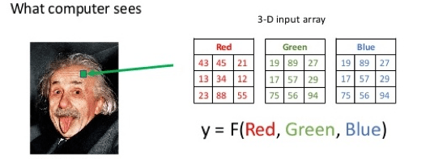
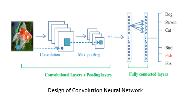
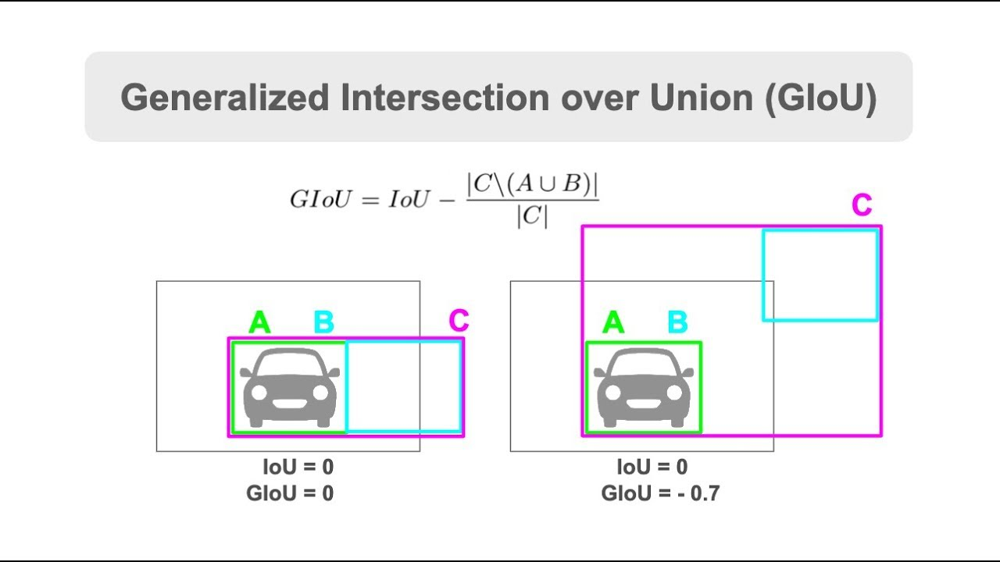

## Image Classification using Machine Learning
**Note: Python 2.x is not supported**


## Python packages
* numpy
* sklearn
* OpenCv
* selectivesearch
* Matplotlib


## Installation ##
>
    
    $ pip3 install -r requirements.txt


## Usage
  


```python3 data-preparation.py```  

```python3 train_NN.py```  


Teaching computers to understand what they see is the subject that keeps all the computer vision engineers awake. Even though a lot of progress has been accomplished in Image Recognition field over the past few years, there are a lot of puzzle pieces still missing that should fit together to get a complete and clear picture on how to teach machines to make sense of what they see.

For a long time Image Classification was not considered as a statistical problem until a partial solution came from the Machine Learning field under the name of Neural Networks, in particular, Convolutional Neural Networks (CNN). CNN is a special type of Artificial Neural Networks that offer human-like results in image classification tasks.

This article explains how the human brain reconstructs the visual world, how machines learn to understand visuals and what the applications of Image Classification are.



##Deep Learning for Image Classification

Deep learning, a subset of Artificial Intelligence (AI), uses large datasets to recognize patterns within input images and produce meaningful classes with which to label the images. A common deep learning method for image classification is to train an Artificial Neural Network (ANN) to process input images and generate an output with a class for the image.

The challenge with deep learning for image classification is that it can take a long time to train artificial neural networks for this task. However, Convolutional Neural Networks (CNNs) excel at this type of task.


-----------------------------------------------------------------

# Convolution with Python(numpy)


To show objects distinctly using the deep learning which is the actively using for last years. In this subject I have tried to show how to apply functions , passing through active functions. In the near future, we will gain in-depth knowledge of the results we have obtained in addition to these codes by developing an artificial neural network with a numpy library


[Selective search](http://www.huppelen.nl/publications/selectiveSearchDraft.pdf)

### Selective Search In Object Recognition :

In selective search paper, authors use this algorithm on object detection and train a model using by giving ground truth examples and sample hypothesis that overlaps 20-50% with ground truth(as negative example) into SVM classifier and train it to identify false positive . The architecture of model used in given below.


## Object Detection and IoU

Intersection over Union (IoU), also known as the Jaccard index, is the most popular evaluation metric for tasks such as segmentation, object detection and tracking. Object detection consists of two sub-tasks: localization, which is determining the location of an object in an image, and classification, which is assigning a class to that object. 



## Reference
* https://giou.stanford.edu/
* https://mc.ai/object-detection-iou-intersection-over-union/
* https://en.wikipedia.org/wiki/Jaccard_index
* https://en.wikipedia.org/wiki/Kernel_(image_processing)
* https://en.wikipedia.org/wiki/Kernel_(image_processing)
* https://www.pyimagesearch.com/
